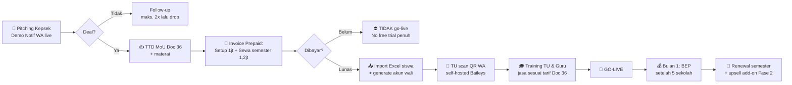
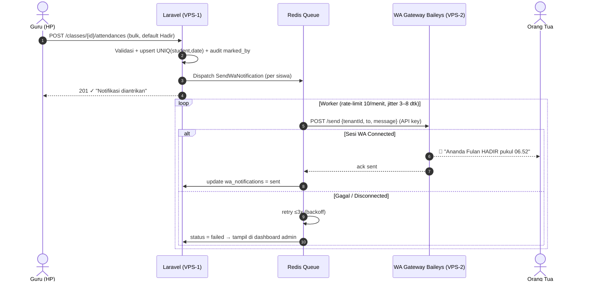
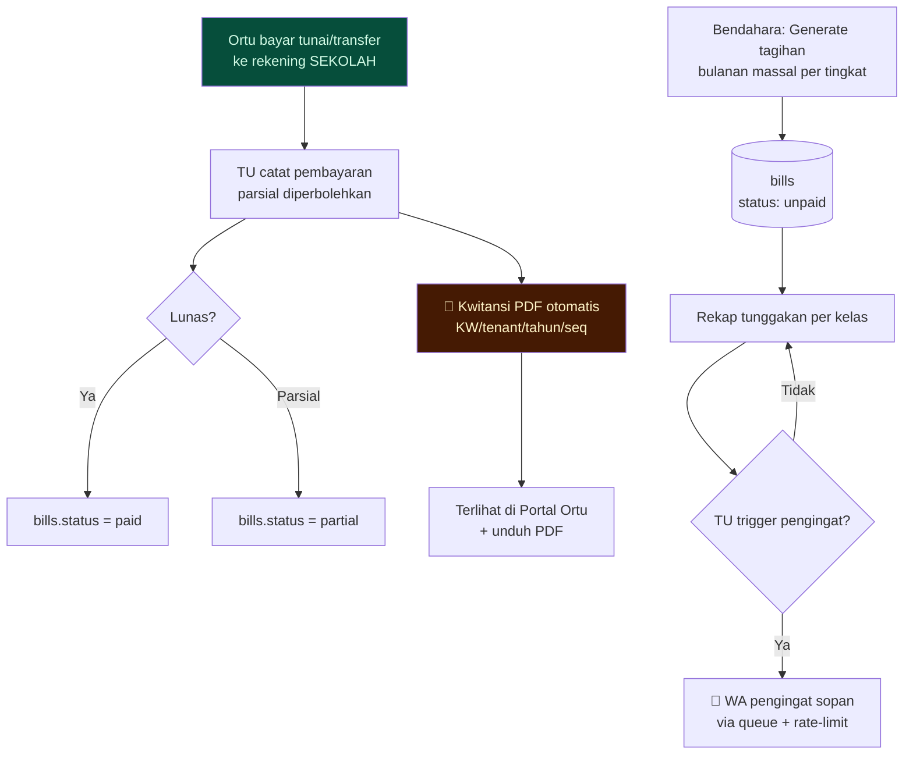
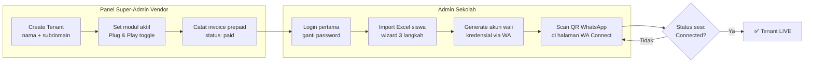
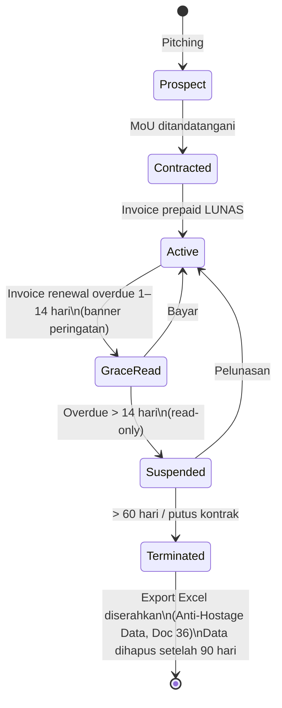
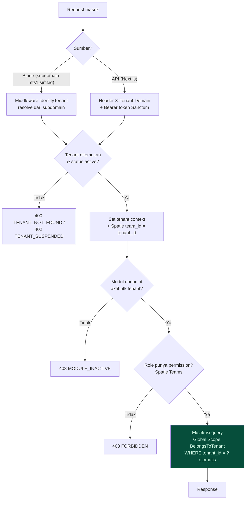
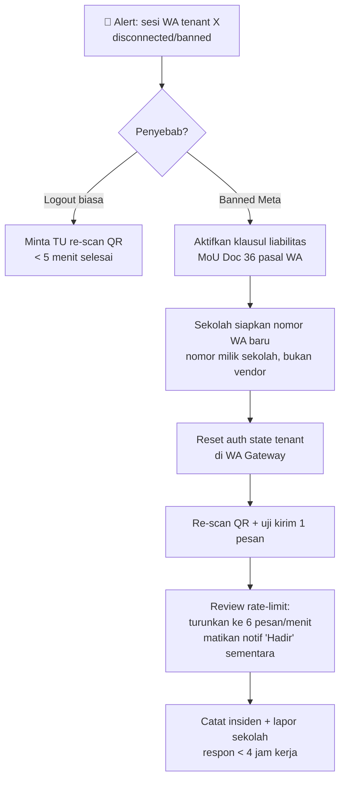
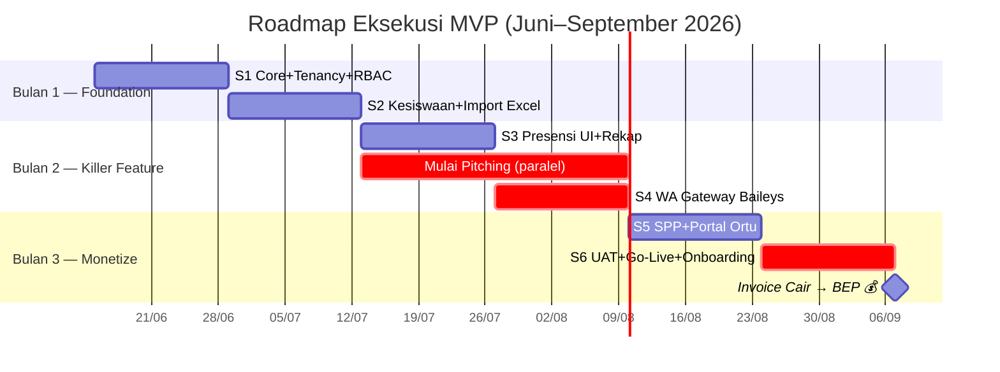

# DIAGRAM PROSES — MVP SIMT MTs
## Business Process & System Flow Diagrams (Mermaid)

**Versi:** 1.0 | **Tanggal:** 12 Juni 2026 | **Doc:** 42
**Catatan:** Render di GitHub/VS Code (Mermaid). Versi visual interaktif: lihat `41_visualisasi_konsep_mvp.html`.

---

## 1. Proses Bisnis End-to-End: Akuisisi → Go-Live → Cash-In

---

## 2. Proses Harian Inti: Presensi → Notifikasi WA (Killer Feature)

---

## 3. Proses Keuangan: SPP Manual + Kwitansi + Pengingat Tunggakan

> 💡 Uang SPP **tidak pernah** lewat rekening vendor (mitigasi risiko hukum, ref. Doc 30/36). Payment Gateway BYOA = add-on Fase 2.

---

## 4. Proses Onboarding Tenant Baru (Target: aktif < 1 hari kerja)

---

## 5. State Diagram: Siklus Hidup Tenant (Penegakan Cash-in-Advance)

---

## 6. Proses Isolasi Multi-Tenant per Request (Keamanan Inti)

---

## 7. Proses Mitigasi Insiden WA Banned (Runbook Ringkas)

---

## 8. Gantt 90 Hari (Sprint 1–6)

