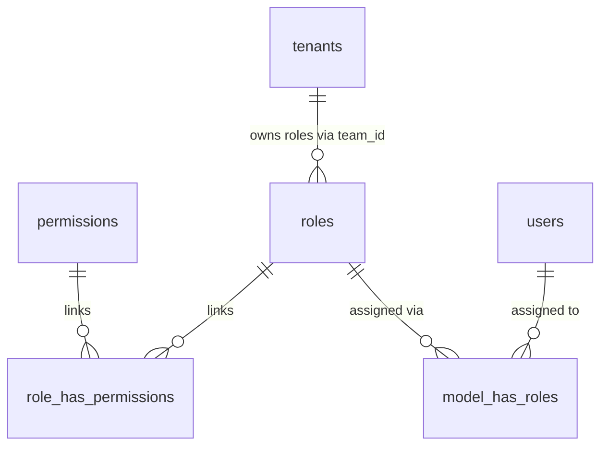

# Analisis Mendalam Implementasi RBAC (Role-Based Access Control) SIMT Backend

Analisis mendalam mengenai sistem otorisasi dan kontrol akses berbasis peran (RBAC) pada repositori **SIMT Backend**. Analisis ini berfokus pada tiga pilar utama: **Granularitas Izin (Granular)**, **Dukungan Basis Data (Database Driven)**, dan **Isolasi Lingkungan Tenant (Scope Tenant Based)**.

---

## 1. Ringkasan Eksekutif

Berdasarkan investigasi terhadap basis data, model data, middleware, dan pengujian unit pada repositori SIMT Backend, sistem otorisasi telah diimplementasikan dengan sangat matang dan terstruktur. 
*   **Granularitas**: Hak akses dipecah secara halus hingga level aksi spesifik per modul (contoh: pembedaan antara `view_students`, `create_students`, `edit_students`, dan `delete_students`).
*   **Database Driven**: Menggunakan pustaka *Spatie Laravel Permission* yang terintegrasi penuh ke dalam tabel database relasional.
*   **Scope Tenant Based**: Menggunakan fitur *Spatie Teams* yang dimanfaatkan sebagai pembatas konteks tenant (`team_id` dipetakan ke `tenant_id`), dipadukan dengan *global scope* query Eloquent untuk menjamin isolasi data mutlak antar penyewa (tenant).

Seluruh 58 uji fitur (*feature tests*) telah berhasil dijalankan dengan status **Lulus (100% Passed)**, membuktikan kekokohan batasan keamanan RBAC yang diterapkan di tingkat API dan Web.

---

## 2. Analisis Dimensi 1: Penerapan Granular

SIMT Backend menghindari penggunaan otorisasi makro (hanya mengecek tipe user secara umum). Sebaliknya, sistem memetakan otorisasi pada tingkat aksi spesifik (granular).

### A. Matriks Izin (Permission Matrix)
Dalam [TenantRoleService.php](file:///d:/laragon/www/simt-backend/app/Services/TenantRoleService.php#L28-L52), didefinisikan matriks izin yang dikelompokkan berdasarkan **6 Peran Utama** dan **23 Granular Permissions** sebagai berikut:

| Peran (Role) | Deskripsi | Daftar Izin Granular (*Permissions*) |
| :--- | :--- | :--- |
| **`admin_sekolah`** | Administrator penuh tingkat sekolah. | Memiliki seluruh 23 izin (manajemen user, role, tenant, siswa, presensi, keuangan, WhatsApp gateway, dan akademik). |
| **`kepala_madrasah`** | Pimpinan sekolah (Executive View). | `view_dashboard`, `view_students`, `view_attendance`, `view_attendance_rekap`, `view_bills`, `view_akademik`, `view_audit_logs`. |
| **`tu`** (Tata Usaha) | Staf administrasi operasional. | `view_dashboard`, `view_students`, `create_students`, `edit_students`, `import_students`, `view_attendance`, `view_attendance_rekap`, `wa.connect`, `view_akademik`, `manage_akademik`, `view_audit_logs`. |
| **`bendahara`** | Pengelola keuangan sekolah. | `view_dashboard`, `view_bills`, `create_bills`, `record_payment`, `print_receipt`, `send_reminders`. |
| **`guru`** | Tenaga pengajar kelas. | `view_dashboard`, `view_students`, `view_attendance`, `mark_attendance`, `edit_attendance`, `view_akademik`, `manage_grades`. |
| **`wali`** | Orang tua / wali murid. | `view_dashboard` (akses detail dibatasi via kepemilikan data / *ownership*). |

> [!NOTE]
> Peran **Superadmin** (`superadmin`) didefinisikan secara khusus untuk administrator tingkat SaaS (lintas-tenant) dengan bypass filter tenant (`tenant_id = null`) untuk mengelola tenant, modul, dan melihat audit log global.

### B. Mekanisme Penegakan Akses (Access Enforcement)
1.  **Enforcement Tingkat Route (Middleware)**
    Spatie middleware digunakan langsung pada definisi rute di berkas modul seperti [Students Web Routes](file:///d:/laragon/www/simt-backend/Modules/Student/routes/web.php#L9-L17) dan [Finance Web Routes](file:///d:/laragon/www/simt-backend/Modules/Finance/routes/web.php#L11-L34):
    ```php
    Route::get('/students', [StudentController::class, 'index'])
        ->name('students.index')
        ->middleware('permission:view_students');
    ```
2.  **Enforcement Tingkat Controller (Contextual / Code-Level Checks)**
    Untuk logika yang lebih kompleks dari sekadar izin statis, controller mengecek izin tambahan. Sebagai contoh, pada [AttendanceController.php](file:///d:/laragon/www/simt-backend/Modules/Attendance/app/Http/Controllers/AttendanceController.php#L83-L89):
    ```php
    if (! $user->can('mark_attendance') && ! $user->can('edit_attendance')) {
        return response()->json(['success' => false, 'message' => 'Unauthorized'], 403);
    }
    ```
3.  **Enforcement Tingkat UI (Blade Directives)**
    Menu navigasi dan aksi tombol dibatasi secara kondisional menggunakan direktif bawaan `@can` untuk menjamin keselarasan tampilan visual dengan hak akses asli di backend.

---

## 3. Analisis Dimensi 2: Berbasis Database Driven

Sistem otorisasi sepenuhnya dikendalikan oleh basis data relasional (*database-driven*), memungkinkan perubahan relasi hak akses secara dinamis tanpa mengubah baris kode aplikasi.

### A. Struktur Skema Tabel (Database Schema)
Skema tabel RBAC didefinisikan dalam berkas migrasi [0001_01_01_000003_create_permission_tables.php](file:///d:/laragon/www/simt-backend/database/migrations/0001_01_01_000003_create_permission_tables.php):
*   **`permissions`**: Menyimpan daftar izin unik (`name`, `guard_name`).
*   **`roles`**: Menyimpan daftar peran sekolah. Kolom `team_id` disertakan untuk melokalisasi peran di tingkat tenant.
*   **`role_has_permissions`**: Tabel pivot penghubung banyak-ke-banyak antara peran dan izin.
*   **`model_has_roles`** & **`model_has_permissions`**: Tabel pivot penghubung pengguna (`User`) ke peran/izin mereka, lengkap dengan kolom `team_id`.



### B. Penyemaian dan Penyediaan Dinamis (Dynamic Provisioning)
1.  **Penyemaian Global**: [RolePermissionSeeder.php](file:///d:/laragon/www/simt-backend/database/seeders/RolePermissionSeeder.php) mendaftarkan izin-izin granular bawaan sistem ke tabel `permissions`.
2.  **Penyediaan Per-Tenant**: Kelas [TenantRoleService.php](file:///d:/laragon/www/simt-backend/app/Services/TenantRoleService.php#L59-L72) menyediakan metode `provisionForTenant(int $tenantId)` untuk menyalin dan membuat peran khusus bagi tenant yang baru mendaftar secara otomatis di basis data:
    ```php
    $role = Role::firstOrCreate([
        'name' => $roleName,
        'guard_name' => 'web',
        'team_id' => $tenantId, // Dibatasi dalam ruang lingkup tenant
    ]);
    $role->syncPermissions($permissions);
    ```

---

## 4. Analisis Dimensi 3: Scope Tenant-Based (Otorisasi Lintas-Tenant)

Sebagai aplikasi SaaS Multi-Tenant, SIMT Backend menerapkan isolasi ketat agar hak akses pengguna terkurung dalam lingkup tenant miliknya dan tidak terjadi kebocoran data (*data leakage*).

### A. Integrasi Spatie Teams dengan Tenancy Singleton
Spatie Permission dikonfigurasi untuk mengaktifkan fitur *Teams* di [config/permission.php](file:///d:/laragon/www/simt-backend/config/permission.php#L23):
```php
'teams' => true,
```
Isolasi tenant-based berjalan melalui siklus request berikut:
1.  **Identifikasi Tenant**: Jalur request melewati middleware [IdentifyTenant.php](file:///d:/laragon/www/simt-backend/app/Http/Middleware/IdentifyTenant.php) (membaca header `X-Tenant-Domain` atau subdomain host) atau [SetTenantFromUser.php](file:///d:/laragon/www/simt-backend/app/Http/Middleware/SetTenantFromUser.php) (membaca `tenant_id` dari user terautentikasi).
2.  **Pengikatan Konteks**: Singleton [Tenancy.php](file:///d:/laragon/www/simt-backend/app/Support/Tenancy.php#L31-L39) dipanggil untuk menetapkan tenant aktif:
    ```php
    public function setTenant(?Tenant $tenant): void
    {
        $this->tenant = $tenant;
        if ($tenant && class_exists(\Spatie\Permission\PermissionRegistrar::class)) {
            // Mengunci seluruh query Spatie ke team_id (tenant_id) saat ini
            app(\Spatie\Permission\PermissionRegistrar::class)->setPermissionsTeamId($tenant->id);
        }
    }
    ```
3.  **Evaluasi Izin**: Setiap panggilan otorisasi (seperti `$user->hasRole(...)` atau `$user->can(...)`) otomatis dievaluasi dengan filter query `team_id = tenant_id`. Ini mencegah hak akses bocor meskipun dua tenant memiliki nama peran yang sama.

### B. Isolasi Entitas Basis Data (Global Query Scoping)
Selain otorisasi RBAC, data domain bisnis (seperti Siswa, Kelas, Tagihan) diisolasi di tingkat query menggunakan Trait [BelongsToTenant.php](file:///d:/laragon/www/simt-backend/app/Traits/BelongsToTenant.php#L32-L37):
```php
static::addGlobalScope('tenant', function (Builder $builder) {
    $tenantId = app(Tenancy::class)->tenantId();
    if ($tenantId) {
        $builder->where($builder->getModel()->getTable() . '.tenant_id', $tenantId);
    }
});
```
Setiap kali entitas baru disimpan, Trait ini juga otomatis menyematkan `tenant_id` yang aktif agar terhindar dari kesalahan input manual.

### C. Validasi Silang Sesi Lintas-Tenant (Cross-Tenant Hardening)
Middleware [IdentifyTenant.php](file:///d:/laragon/www/simt-backend/app/Http/Middleware/IdentifyTenant.php#L70-L80) menyertakan validasi silang sesi demi mencegah serangan pembajakan domain:
```php
if ($request->user() && !$request->user()->isSuperAdmin() && $request->user()->tenant_id !== $tenant->id) {
    abort(403, 'Unauthorized Tenant Access');
}
```
Jika pengguna dari `Tenant A` mencoba menembak API atau memuat halaman dengan header/subdomain `Tenant B`, sistem akan mendeteksi ketidakcocokan sesi dan langsung memblokir request dengan respons **403 Forbidden**.

---

## 5. Bukti Pengujian Keandalan (Test Suite Passes)

Isolasi RBAC dan batasan Multi-Tenant ini dilindungi oleh kumpulan uji fitur yang komprehensif. Berikut adalah asersi pengujian utama yang berhasil divalidasi:

1.  **Uji Isolasi Siswa Lintas-Tenant** ([TenantIsolationTest.php](file:///d:/laragon/www/simt-backend/tests/Feature/TenantIsolationTest.php#L130-L138)):
    *   *Skenario*: Pengguna di `Tenant 2` mencari data siswa milik `Tenant 1`.
    *   *Hasil*: Kueri mengembalikan `null` atau kosong karena batasan global scope query.
2.  **Uji Pergantian Konteks Dinamis** ([TenantIsolationTest.php](file:///d:/laragon/www/simt-backend/tests/Feature/TenantIsolationTest.php#L194-L221)):
    *   *Skenario*: Mengubah konteks `Tenancy::setTenant()` dari Tenant 1 ke Tenant 2 secara run-time.
    *   *Hasil*: Visibilitas data berubah seketika secara dinamis dan konsisten.
3.  **Uji Otorisasi Kelas Berbasis Guru** ([AttendanceModuleTest.php](file:///d:/laragon/www/simt-backend/tests/Feature/AttendanceModuleTest.php)):
    *   *Skenario*: Pengguna dengan peran `guru` mencoba menginput presensi atau rekap untuk kelas yang diampu oleh guru lain.
    *   *Hasil*: Ditolak secara kontekstual dengan respons `403 Forbidden`.
4.  **Uji Proteksi Pembatasan Super-Dashboard** ([SuperAdminTest.php](file:///d:/laragon/www/simt-backend/tests/Feature/SuperAdminTest.php#L74-L81)):
    *   *Skenario*: Kepala Madrasah / TU mencoba membuka panel administrasi global SaaS `/super`.
    *   *Hasil*: Ditolak dengan respons `403 Forbidden`.

---

## 6. Analisis Celah Keamanan & Rekomendasi (Gap Analysis)

Meskipun implementasi saat ini sudah memenuhi standar keamanan *production-grade*, berikut adalah analisis celah potensial beserta saran pengembangan ke depan:

| Temuan / Celah Potensial | Dampak Risiko | Rekomendasi Mitigasi |
| :--- | :--- | :--- |
| **Pengecekan Kepemilikan (Ownership) secara Ad-Hoc di Controller** | Logika pengecekan kepemilikan kelas guru (misal: `$class->teacher_id === $user->id`) ditulis secara manual di dalam method controller. Hal ini berpotensi terlewat pada endpoint baru. | Mengonsolidasikan logika kepemilikan data ke dalam **Laravel Policies** (misal: `ClassroomPolicy`, `StudentPolicy`) sesuai rancangan awal dokumen arsitektur demi meningkatkan standarisasi kode. |
| **Bypass Caching pada Perubahan Konteks Tim Spatie** | Pemanggilan `setPermissionsTeamId` secara intensif tanpa penanganan cache yang tepat berisiko memicu query berlebih ke database relasional pada beban tinggi (*high concurrency*). | Memastikan Spatie permission caching diaktifkan di tingkat Redis/Predis dengan konfigurasi tag *tenant-specific* demi mereduksi beban database. |
| **Otorisasi Kepemilikan Wali Murid di API** | Wali murid hanya boleh melihat anak kandungnya sendiri. Pengecekan ini saat ini dilakukan di controller secara manual. | Menggunakan *Route Model Binding* yang dikombinasikan dengan *Scope* relasi bawaan (misal: `$user->guardianStudents()->findOrFail($studentId)`) untuk memangkas celah kebocoran ID siswa acak (*IDOR - Insecure Direct Object Reference*). |

---
*Laporan Analisis RBAC disiapkan dengan cermat menggunakan verifikasi kode aktual dan hasil eksekusi test suite per tanggal 16 Juni 2026.*
